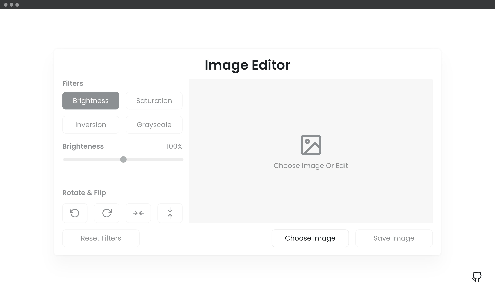
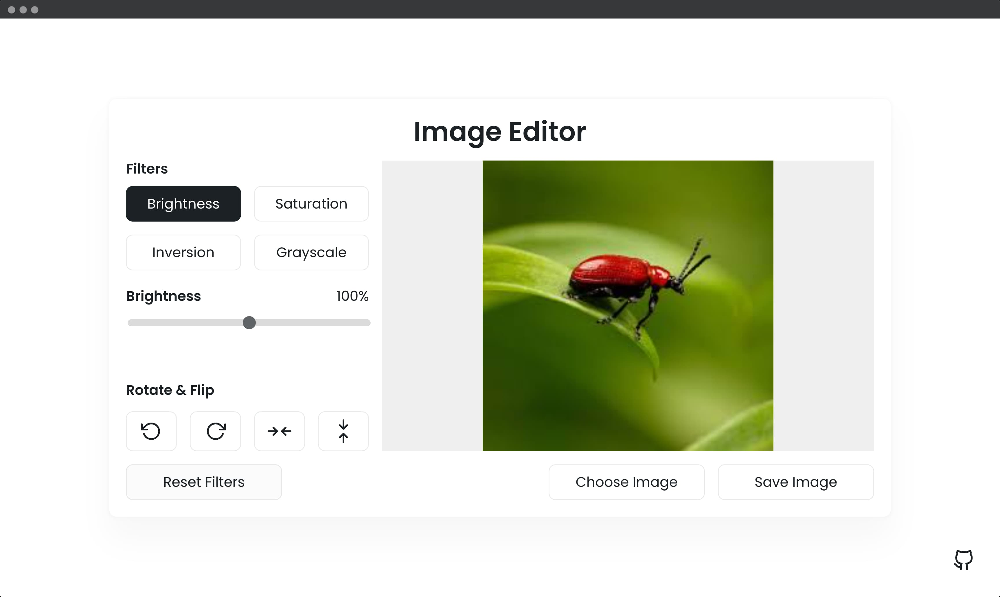

## 📦 Image Editor App

In this image editor, you can apply different filters to their image like grayscale, inversion, saturation, and adjust the image brightness. You can also rotate/flip the images and save their edited images.

---

#### 🌄 Screenshots:

-----

#### 💻 Stack:

- [JavaScript](https://learn.javascript.ru/)
- [Sass](https://sass-lang.com/)

-----

#### 🙌 Author: [@nagoev-alim](https://github.com/nagoev-alim)
